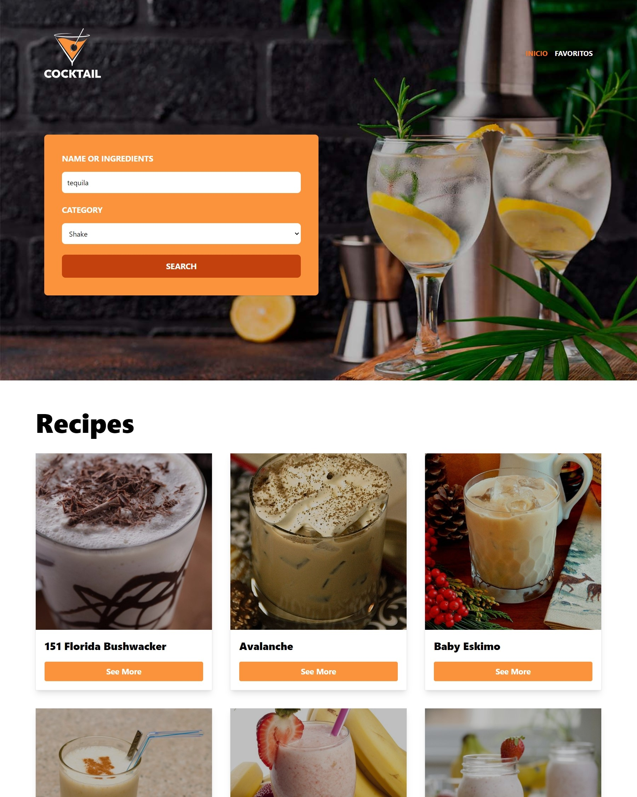

# Drinks Researcher -API

By consmuming an API I have created this researcher, it's some validations to each state and action, I used Zustand to the Global State management, creatig 2 diferent stores. This is my first project usin React-Router, I learnd about performance, Routes and some components and functions from this library.

## Tools
- React
- TypeScript
- TailwindCSS
- react-toastify
- Zustand
- Axios
- Zod
- React Router DOM
- API

## Link
(https://willowy-swan-706e0f.netlify.app/)

